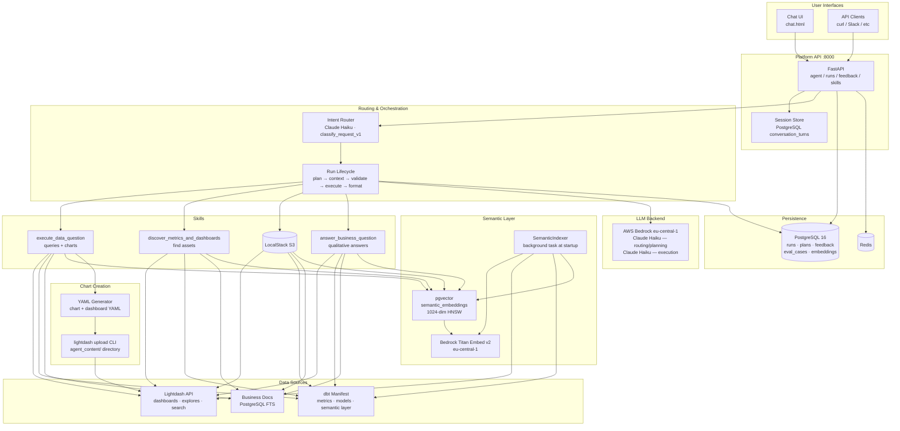
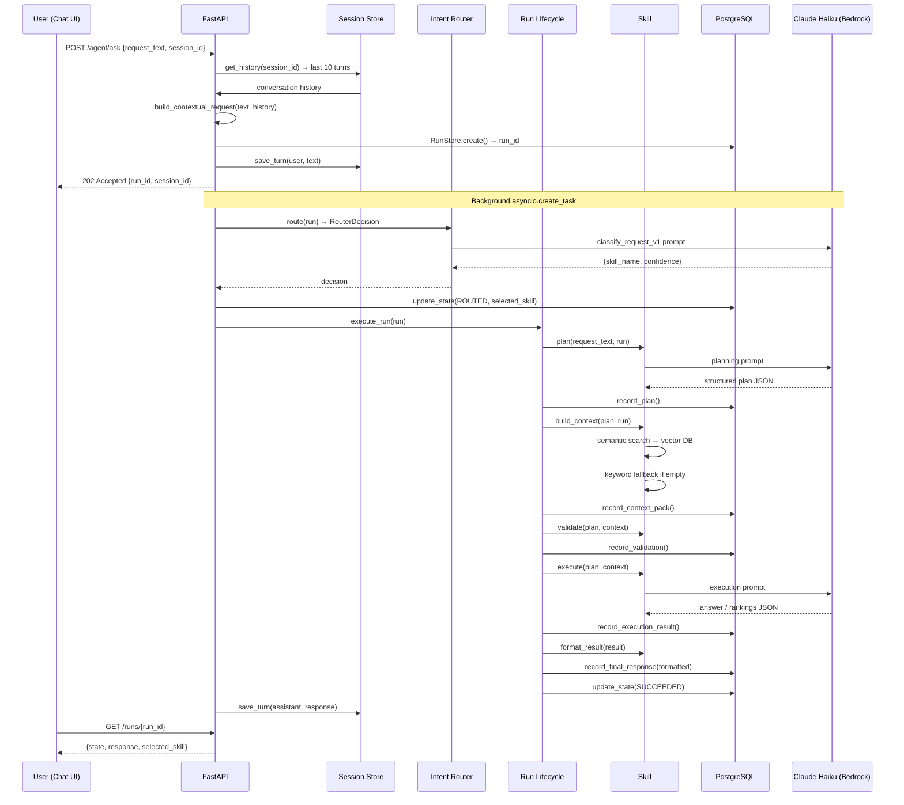
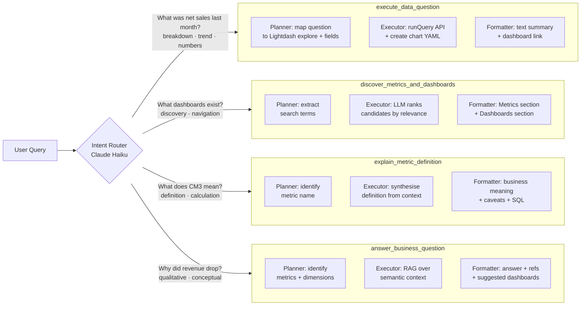
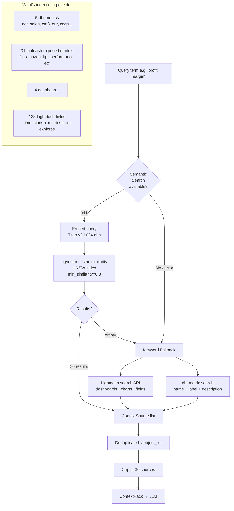
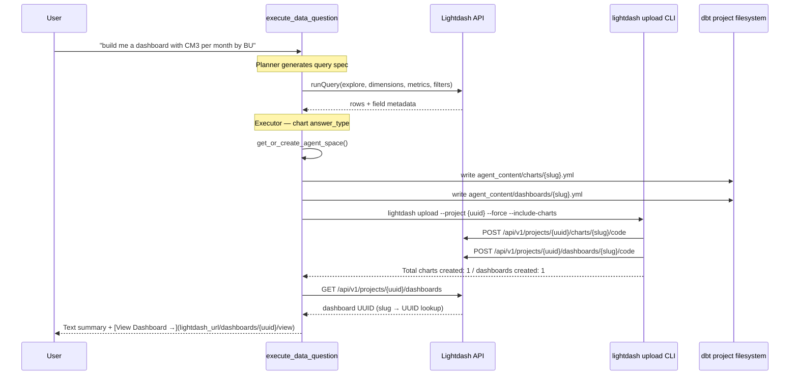
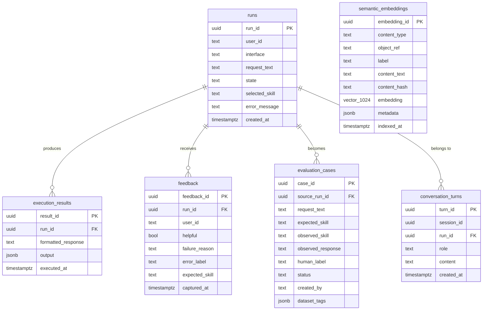

# Agentic Data Platform — Architecture

## 1. High-Level System Overview



---

## 2. Request Lifecycle

Every user message goes through a deterministic pipeline with full audit trail:



---

## 3. Four Skills — Capabilities & Routing



---

## 4. Context Retrieval — Semantic + Keyword



---

## 5. Chart & Dashboard Creation



---

## 6. Semantic Indexer (Startup)

```mermaid
graph TD
    START[API startup<br/>AppContainer.create()] --> BG[asyncio.create_task<br/>SemanticIndexer.run_full_index]

    BG --> CHECK{pgvector<br/>available?}
    CHECK -->|No| SKIP[Skip — log warning<br/>keyword search still works]

    CHECK -->|Yes| IDX_M[Index dbt metrics<br/>name + label + description]
    IDX_M --> IDX_MOD[Index Lightdash-exposed<br/>dbt models only<br/>not all 1500+ staging models]
    IDX_MOD --> IDX_LD[Index Lightdash assets<br/>dashboards + explore fields]

    subgraph "Per content type"
        HASH[Compute SHA-256<br/>of content_text]
        COMPARE{hash changed<br/>vs DB?}
        COMPARE -->|Same| SKIP2[Skip re-embedding]
        COMPARE -->|Different| EMBED2[Call Titan Embed v2<br/>batch_size=10 concurrent]
        EMBED2 --> UPSERT[pgvector upsert<br/>ON CONFLICT UPDATE]
        HASH --> COMPARE
    end

    IDX_M & IDX_MOD & IDX_LD --> HASH
    UPSERT --> STALE[delete_stale:<br/>remove refs no longer in source]
    STALE --> DONE[Log: N items indexed]
```

---

## 7. Conversation Memory & Feedback Loop

```mermaid
graph LR
    subgraph "Conversation Memory"
        ASK[POST /agent/ask<br/>session_id optional] --> HISTORY[Load last 10 turns<br/>from conversation_turns]
        HISTORY --> AUGMENT[Prepend history to request<br/>build_contextual_request]
        AUGMENT --> RUN[Execute run]
        RUN --> SAVE_USER[save_turn: user]
        RUN --> SAVE_ASST[save_turn: assistant]
        SAVE_USER & SAVE_ASST --> PG2[(conversation_turns)]
    end

    subgraph "Feedback Loop"
        THUMB[User clicks thumbs down] --> PANEL[In-chat labelling panel]
        PANEL --> LABEL1[error_label:<br/>wrong_skill · wrong_query<br/>incomplete · hallucination]
        PANEL --> LABEL2[expected_skill dropdown<br/>pre-set to observed skill]
        LABEL1 & LABEL2 --> FB[POST /feedback/{run_id}<br/>helpful=false + labels]
        FB --> EVAL[Background task:<br/>_maybe_create_eval_case]
        EVAL --> EC[(evaluation_cases<br/>status=failing<br/>human_label filled<br/>observed_response stored)]
    end

    EC -.->|future: make run-eval| HARNESS[EvalHarness<br/>routes + scores cases]
    HARNESS -.-> REPORT[Pass rate per skill<br/>regression detection]
```

---

## 8. Data Model (PostgreSQL)



---

## 9. Technology Stack

| Layer | Technology |
|---|---|
| API | FastAPI + uvicorn |
| LLM | AWS Bedrock — Claude Haiku (routing, planning, execution) |
| Embeddings | AWS Bedrock — Titan Embed v2 (1024-dim) |
| Vector DB | pgvector (PostgreSQL extension) with HNSW index |
| Database | PostgreSQL 16 (runs, feedback, embeddings, sessions) |
| Cache | Redis |
| Object Store | LocalStack S3 (dev) |
| Semantic Layer | dbt (Snowflake, browser SSO) + Lightdash |
| Chart creation | Lightdash CLI (`lightdash upload`) + YAML as code |
| Package manager | uv (Python monorepo, 15 workspace packages) |
| Python | 3.12, async throughout (asyncio, SQLAlchemy async, asyncpg, httpx) |
| Infra | Docker Compose (local dev) |
